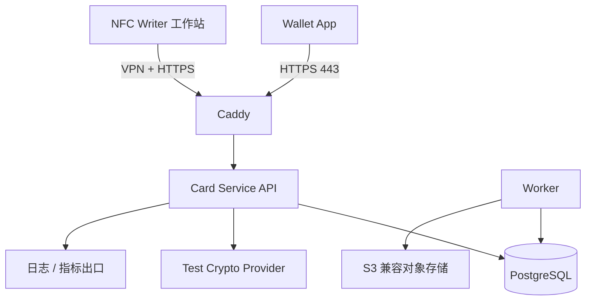
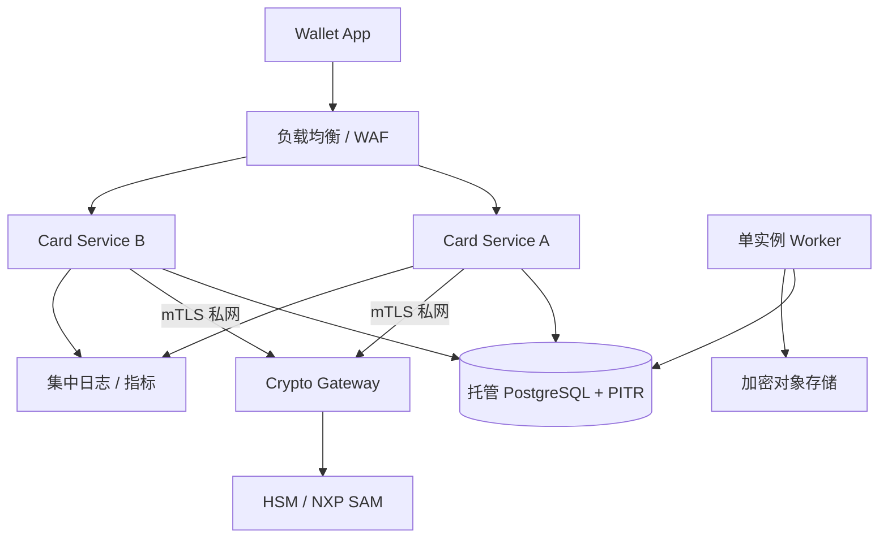
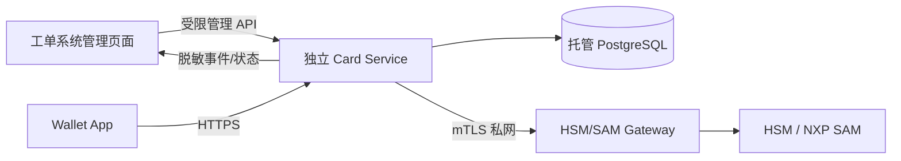

# Secure NFC Card Service 轻量级服务器部署方案

> 文档状态：设计稿 v1.0  
> 编制日期：2026-09-02  
> 关联方案：`secure-nfc-multi-card-wallet-technical-design.md` v1.1  
> 适用范围：内部测试网、小批量试点，以及向真实资产生产环境演进的最小部署基线

## 1. 部署结论

轻量部署不使用 Kubernetes、Redis、独立消息队列或大型日志集群，采用以下最小组件：

- Caddy：公网 TLS、反向代理和安全响应头；
- Card Service：单体但模块化的无状态 API 服务；
- Worker：与 API 使用同一镜像，处理审计导出、过期会话清理和异步任务；
- PostgreSQL：业务数据、短时验证会话、幂等记录、Outbox 和任务队列；
- Crypto Provider：统一密码接口，测试环境使用测试密钥实现，生产环境连接 HSM/SAM Gateway；
- S3 兼容对象存储：数据库备份、WAL、审计归档和发布物保存。

部署分成两个明确等级：

| 等级 | 拓扑 | 用途 | 是否允许真实资产 |
| --- | --- | --- | --- |
| L0 单机测试版 | 1 台云主机运行 Caddy、API、Worker、PostgreSQL 和测试 Crypto Provider | 开发、测试网、实体卡协议联调 | 不允许 |
| L1 轻量生产版 | 2 个 API 实例、托管 PostgreSQL、独立 HSM/SAM Gateway、对象存储 | 小批量受限试点 | 通过安全审计和上线门槛后才允许 |

**单机部署无法满足原技术方案中的高可用上线门槛。** 即使功能完整，也只能作为测试网或内部试点环境，不能通过配置开关直接升级成真实资产生产环境。

## 2. 设计目标与容量假设

### 2.1 目标

- 一台小规格云主机即可启动完整测试服务；
- 客户 APK 内不出现生产卡主密钥或每卡长期密钥；
- SUN/SDM 初筛和 EV2 在线认证具备严格状态机；
- 卡片认领、计数器推进、挑战和令牌消费全部原子化；
- 可以在不改 API 契约的情况下切换测试 Crypto Provider 与 HSM/SAM Gateway；
- 数据库、审计和配置具备可验证恢复能力；
- 后续可通过增加 API 实例和迁移托管数据库平滑升级。

### 2.2 初始容量假设

以下只是选型和压测起点，不是未经验证的性能承诺：

- 已发行卡片不超过 10,000 张；
- 平均 API 请求小于 5 RPS，短时峰值不超过 20 RPS；
- 同时进行的 EV2 会话不超过 20 个；
- 业务数据库不超过 20 GB；
- 单次 EV2 会话生命周期不超过 15 秒；
- App 保持贴卡期间最多进行两次服务端网络往返。

超过任一假设或 HSM/SAM 成为瓶颈时，必须按第 15 节扩容，不能只提高接口超时。

## 3. 总体拓扑

### 3.1 L0 单机测试版



建议起步资源：

| 资源 | 建议值 |
| --- | --- |
| 云主机 | 2 vCPU / 4 GB RAM |
| 系统盘 | 20 GB |
| 独立数据盘 | 60 GB SSD，可加密 |
| 操作系统 | 当前受支持的 Ubuntu Server LTS 或等价发行版 |
| 容器运行时 | Docker Engine + Compose Plugin，固定受支持版本 |
| 公网端口 | 80、443；80 仅用于跳转和证书签发 |
| 管理入口 | VPN 或固定管理网段；SSH 不对全网开放 |

L0 容器初始资源上限：

| 服务 | CPU 上限 | 内存上限 | 备注 |
| --- | --- | --- | --- |
| Caddy | 0.25 vCPU | 128 MB | 证书目录必须持久化 |
| Card Service | 1 vCPU | 1 GB | JVM 最大堆建议从 512–640 MB 起测 |
| Worker | 0.5 vCPU | 384 MB | 低并发，可与 API 使用同一镜像 |
| PostgreSQL | 1 vCPU | 1.25 GB | 数据盘独占，连接数保持较小 |
| Test Crypto Provider | 0.25 vCPU | 256 MB | 仅测试环境 |

上述是资源约束起点。主机至少保留约 700 MB 给操作系统、容器运行时、文件缓存和短时峰值；发生 OOM 或持续交换时直接升级到 8 GB，不通过关闭数据库安全设置节省内存。

测试 Crypto Provider 只能使用明确标记的测试密钥。服务启动时必须校验 `DEPLOYMENT_TIER=L0_TESTNET` 和允许的测试链；任一生产链配置出现时直接拒绝启动。

### 3.2 L1 轻量生产版



最低建议：

| 组件 | 最小配置 |
| --- | --- |
| API 实例 | 2 × 2 vCPU / 4 GB，跨故障域 |
| PostgreSQL | 托管单主 + 自动备份/PITR，私网访问 |
| Crypto Gateway | 独立受控主机或设备，不与公网 API 共用宿主机 |
| HSM/SAM | 真实资产至少 1 套活动设备和 1 套可验证切换的备用设备，具备受控备份和恢复介质 |
| 对象存储 | 服务端加密、版本控制、保留策略和独立凭证 |

L1 不要求 Kubernetes。两个 API 实例可以由云主机、托管容器服务或简单的系统服务运行，但必须使用同一不可变镜像版本，并通过负载均衡健康检查切流。

## 4. 组件与技术选型

| 组件 | 推荐实现 | 选择理由 |
| --- | --- | --- |
| Card Service | Kotlin/JVM 21 + Ktor，单体模块化 | 与现有 Java/Kotlin NFC 代码和密码实现衔接成本低，资源占用可控 |
| 数据访问 | JDBC + HikariCP + jOOQ/Exposed，二选一 | 支持显式事务、条件更新和数据库约束 |
| 数据迁移 | Flyway 或同类单向版本迁移工具 | 发布时可审计、可重复 |
| 数据库 | PostgreSQL 当前受支持版本，生产固定补丁版本 | 可同时承担事务、短任务、幂等和行级并发控制 |
| 公网入口 | Caddy 官方镜像 | 自动 HTTPS、配置简单、支持健康检查与反向代理 |
| 异步任务 | PostgreSQL Outbox + `FOR UPDATE SKIP LOCKED` | 初期无需 Redis/Kafka，避免增加运维面 |
| 观测 | 结构化日志 + OpenTelemetry Exporter | 可先输出到托管观测平台，后续不改业务埋点 |
| Crypto Provider | 接口化实现：Test Provider / HSM-SAM Gateway | 保证测试与生产密钥边界不会混入业务代码 |

不建议直接复用 Android 模块作为服务器依赖。可抽取纯 JVM 的协议数据模型、编码测试向量和常量时间工具，但 Android NFC 传输、`BuildConfig` 和本地存储代码不得进入服务端。

## 5. 服务端模块边界

Card Service 仍作为一个部署单元，但内部必须保留以下模块边界：

| 模块 | 职责 |
| --- | --- |
| Public Redirect | 处理 `/t/{cardInstanceId}`、解析原始 NDEF 参数、SUN 校验和安全重定向 |
| Card Verification | 创建验证会话、执行 EV2 帧状态机、签发单次卡验证令牌 |
| Provisioning | 发卡任务、原创性检查结果、回读证明、隔离和完成状态 |
| Wallet Binding | 钱包认领、备用卡、卡片状态和唯一绑定约束 |
| Device Authorization | 设备 challenge、请求签名、Attestation 验证和设备撤销 |
| Transaction Approval | 规范化 `txHash` 挑战、卡片在场验证和单次批准令牌 |
| Crypto Adapter | 唯一允许调用 Crypto Provider 的边界，不允许业务模块执行任意 AES |
| Audit | 安全事件、管理操作、风险码和异步归档 |
| Maintenance Worker | 过期会话清理、Outbox 投递、备份检查和计数器预警 |

Crypto Adapter 只能暴露按用途设计的高层命令，例如：

```text
verifySdm(cardHandle, rawNdef)
startEv2(cardHandle, purpose, resourceDigest, firstCardFrame)
continueEv2(sessionHandle, expectedFrameIndex, cardFrame)
finishEv2(sessionHandle, finalCardFrame)
deriveProvisioningCommands(jobHandle, cardIdentity)
```

禁止提供 `encrypt(keyId, bytes)`、`decrypt(keyId, bytes)` 或任意 CMAC 接口给公网请求路径，避免将服务变成 HSM oracle。

## 6. 域名、路由与网络

### 6.1 域名建议

| 域名 | 用途 | 暴露范围 |
| --- | --- | --- |
| `card.example.com` | NDEF 入口和浏览器跳转 | 公网 |
| `api.card.example.com` | Wallet App API | 公网 HTTPS |
| `provision.card.internal` | 发卡工作站 API | VPN/私网 + mTLS |
| `crypto.card.internal` | HSM/SAM Gateway | 仅 API 私网 + mTLS |

入口 URL 保持短且稳定：

```text
https://card.example.com/t/{cardInstanceId}?v=2&kv=1&picc=...&mac=...
```

`card.example.com` 验证 SUN 后，从数据库读取 `target_url` 并返回重定向。`target_url` 必须为 HTTPS，经过允许协议、域名策略和开放重定向检查；禁止直接信任 NDEF 或请求参数提供的目标地址。

### 6.2 网络规则

- 公网只开放 TCP 80/443；
- SSH 只允许 VPN、堡垒机或固定管理网段，并只使用密钥认证；
- PostgreSQL 不绑定公网地址；
- Crypto Gateway 只接受 API 实例的 mTLS 身份；
- Provisioning API 同时要求 VPN、工作站 mTLS 和一次性发卡凭证；
- `/metrics`、数据库管理和容器管理端口不得暴露公网；
- API 默认禁用浏览器 CORS，只有明确的管理前端才配置精确 Origin；
- 出站网络采用允许列表：数据库、Crypto Gateway、对象存储、Attestation/撤销数据源、时间同步和观测出口。
- Caddy、负载均衡、WAF 和 CDN 的访问日志必须删除查询串和敏感头；不得把 `picc`、`mac`、原始 NDEF 或设备签名写入边缘日志。
- `/t/*`、卡验证和交易挑战响应设置 `Cache-Control: no-store`；跳转响应设置 `Referrer-Policy: no-referrer`，禁止 CDN 缓存 SUN 证据。

### 6.3 超时和请求限制

| 项目 | 初始值 | 说明 |
| --- | --- | --- |
| 普通 API 请求体 | 64 KiB | NDEF 和签名材料远小于该值 |
| EV2 帧请求体 | 4 KiB | 超出立即拒绝，不转发 Crypto Provider |
| 单请求服务端超时 | 5 秒 | EV2 会话由总生命周期另行控制 |
| EV2 会话总时长 | 15 秒 | 超时销毁服务端与 HSM 会话 |
| EV2 最大帧数 | 按固定 profile 精确配置 | 不接受额外或乱序帧 |
| 数据库事务超时 | 3 秒 | 防止认领/计数器锁长期占用 |

具体值必须通过实体卡和目标地区网络压测确认。不得通过无限增加超时来掩盖 Crypto Gateway 或数据库故障。

## 7. PostgreSQL 设计与并发控制

数据库采用原技术方案中的表，并增加：

- `provisioning_jobs`：发卡任务、步骤、工作站、截止时间和最终回读摘要；
- `card_verification_sessions`：用途、资源、帧索引、HSM 会话引用、过期和消费状态；
- `transaction_challenges`：规范化交易摘要、设备、钱包、过期和消费状态；
- `idempotency_records`：调用方、接口、幂等键、请求摘要和最终响应摘要；
- `outbox_events`：需要异步归档或投递的已提交事件；
- `redirect_targets`：卡片跳转目标、版本、变更人和审计记录。

必须由数据库强制执行的规则：

1. `card_instance_id` 全局唯一；
2. 一张卡最多存在一个活动绑定，使用部分唯一索引；
3. SUN 计数器只允许原子前进，使用带旧值条件的 `UPDATE` 或行锁；
4. 验证令牌和交易批准令牌最多消费一次；
5. 同一调用方和接口的幂等键唯一，请求摘要不同则拒绝复用；
6. 发卡任务只能按定义状态迁移，失败卡必须进入 `QUARANTINED`；
7. 业务变更和 Outbox 事件在同一事务提交。

短时会话保存在 PostgreSQL，不引入 Redis。EV2 密码会话本身只保留在 Crypto Gateway/HSM 的短时内存中；数据库只保存短时、不可预测且绑定 mTLS 调用方的 HSM 会话引用。进程重启或密码节点切换时直接令该次贴卡失败并重新开始，绝不把会话密钥写入数据库以追求续传。

## 8. 密钥和秘密管理

### 8.1 L0 测试环境

- 只使用与生产完全不同的测试主密钥和测试签名键；
- 密钥通过受限文件或容器 secret 挂载，不写入镜像、Compose 文件、Git、日志和命令行；
- 启动页、API 响应和发卡工具明确标记 `TESTNET / TEST KEY`；
- 测试备份不得恢复到 L1 环境；
- 测试卡不能通过生产 Card Service 验证。

### 8.2 L1 生产环境

- NTAG 五类主密钥只存在于 HSM/SAM 安全边界；
- API 只保存 `hsm_key_handle`，不保存主密钥和每卡长期密钥；
- Crypto Gateway 使用独立 mTLS 证书，证书私钥不可与 API TLS 证书共用；
- 验证令牌和交易批准令牌使用独立服务签名键，优先由 KMS/HSM 执行签名；
- 数据库凭证、对象存储凭证和 mTLS 材料来自云 Secret Manager 或权限为 `0400` 的受限挂载文件；
- 主密钥创建、备份、恢复、轮换和销毁执行双人复核，并生成不可变审计记录；
- 活动与备用 HSM/SAM 的密钥同步必须使用厂商支持的安全备份/导入流程，并实际演练切换；禁止通过应用导出明文密钥实现同步；
- 生产 Crypto Provider 不提供软件回退。HSM/SAM 不可用时相关操作失败关闭。

### 8.3 密钥轮换

| 密钥 | 轮换方式 |
| --- | --- |
| API TLS 证书 | 自动续期，监控剩余有效期 |
| API ↔ Crypto Gateway mTLS | 新旧证书短时并行，逐实例切换 |
| 令牌签名键 | `kid` 区分，新键签发、旧键只验签到最长令牌过期 |
| 数据库/对象存储凭证 | 双凭证切换或短时动态凭证 |
| NTAG 主密钥 | 新增 `keyVersion`，按卡执行实体 ChangeKey 和回读；禁止只改数据库 |

## 9. 容器与主机布局

建议后续在仓库中增加以下部署目录：

```text
deploy/card-service/
├── compose.yml
├── compose.testnet.yml
├── compose.production.yml
├── Caddyfile
├── env.example
├── config/
│   ├── application-testnet.yaml
│   └── application-production.yaml
├── scripts/
│   ├── health-check.ps1
│   ├── backup-check.ps1
│   └── restore-drill.md
└── README.md
```

Compose 服务建议：

| 服务 | L0 | L1 |
| --- | --- | --- |
| `caddy` | 本机运行 | 可由云负载均衡代替或保留 |
| `card-service` | 1 个 | 2 个独立实例 |
| `worker` | 1 个 | 1 个，使用数据库租约避免双跑 |
| `postgres` | 本机容器 | 托管数据库，不进入 Compose |
| `crypto-test` | 仅 L0 | 禁止 |
| `otel-collector` | 可选小实例 | 推荐，或直接导出托管平台 |

容器安全基线：

- 使用固定镜像 digest，不使用浮动 `latest`；
- 非 root 用户运行，根文件系统只读；
- 删除全部 Linux capabilities，需要时逐项添加；
- 不挂载 Docker socket；
- 数据、日志和 Caddy 证书使用独立持久卷；
- 设置内存/CPU 限制、健康检查、日志滚动和自动重启策略；
- API 容器不包含编译工具、测试密钥、源码仓库或 NFC Writer 管理能力。

## 10. 发布流程

### 10.1 首次部署

1. 准备域名、DNS、云主机、私网、防火墙和加密数据盘；
2. 配置可靠时间同步，检查时钟偏差告警；
3. 创建数据库角色：迁移角色、运行时角色、只读审计角色相互分离；
4. 准备对象存储、备份保留策略和恢复测试位置；
5. L0 装载测试密钥；L1 先完成 HSM/SAM 密钥仪式和 Crypto Gateway mTLS；
6. 以镜像 digest 部署 Caddy、API 和 Worker；
7. 使用独立迁移任务执行数据库迁移，API 运行账户不得拥有 DDL 权限；
8. 检查 `/livez`、`/readyz`、数据库、Crypto Provider、对象存储和证书状态；
9. 使用专用测试卡执行 SUN、EV2、认领、重放拒绝和超时清理冒烟测试；
10. 开启外部可用性探测后再放行 Wallet App 流量。

### 10.2 日常发布

- CI 构建不可变镜像，生成 SBOM、依赖漏洞报告和签名；
- 测试环境通过协议向量、数据库并发和实体卡回归后才能推广；
- 数据库采用向后兼容的 expand/migrate/contract 迁移；
- L1 逐实例滚动更新，先停止接收新 EV2 会话，再等待最长 15 秒让旧会话结束；
- 回滚只回滚应用镜像；数据库迁移必须提前设计成旧版本可读取；
- 发布后核对 EV2 成功率、HSM 延迟、数据库锁等待和安全事件基线。

## 11. 备份与恢复

### 11.1 建议目标

| 环境 | RPO | RTO | 说明 |
| --- | --- | --- | --- |
| L0 | 24 小时 | 4 小时 | 测试数据可重建，不承诺高可用 |
| L1 | 5 分钟以内 | 1 小时以内 | 以托管 PostgreSQL PITR 和演练结果为准 |

### 11.2 数据库

- L0 每日执行加密基础备份，并把备份复制到不同故障域的对象存储；
- L1 使用持续 WAL 归档/PITR，加密传输和保存；
- 保留至少 30 天恢复窗口，具体期限由审计和隐私策略确认；
- 每月至少执行一次自动恢复验证，每季度执行完整人工灾难恢复演练；
- 监控最近成功备份、WAL 归档延迟、对象存储失败和恢复校验结果；
- 备份数据库不等于备份 HSM，HSM/SAM 密钥材料按厂商安全流程单独备份。

### 11.3 配置和审计

- Caddy、Compose、数据库迁移和非秘密配置进入版本控制；
- Secret Manager 中的秘密只备份元数据和恢复流程，不导出到普通对象存储；
- 安全事件按日导出到启用版本控制或对象锁的存储；
- 审计导出前删除完整 NDEF、完整 APDU、动态认证数据、UID、密钥和凭证；
- 恢复后必须验证卡片状态、最新计数器、令牌消费状态和审计链连续性。

## 12. 监控与告警

### 12.1 必须监控的指标

| 分类 | 指标 |
| --- | --- |
| API | 请求量、错误率、P50/P95/P99、限流、请求体拒绝 |
| SUN | 验证成功率、MAC 失败、重复/倒退计数器、计数器剩余空间 |
| EV2 | 会话创建、成功率、各帧耗时、超时、乱序、移卡和 HSM 错误 |
| 交易 | 挑战过期、`txHash` 不一致、批准令牌重复消费 |
| 发卡 | 成功率、步骤耗时、`QUARANTINED` 数量和重复 UID/card ID |
| 数据库 | 连接池、慢查询、锁等待、磁盘、WAL 归档延迟 |
| Crypto | HSM/SAM 可用性、调用延迟、会话容量和认证失败 |
| 主机 | CPU、内存、磁盘、inode、网络、时钟偏差和证书有效期 |
| 备份 | 最近成功时间、恢复验证时间和对象存储错误 |

指标标签禁止包含 UID、完整 `cardInstanceId`、钱包地址或设备公钥。需要关联时使用短时审计 ID 或服务端不可逆的低基数分组。

### 12.2 告警等级

- P1：数据库不可用、Crypto Gateway/HSM 不可用、生产主机磁盘即将写满、备份恢复失败、计数器回退或验证令牌出现双消费；
- P2：EV2 成功率明显下降、延迟超过 SLA、Attestation 撤销数据过期、`QUARANTINED` 激增；
- P3：单实例重启、证书进入续期窗口、对象存储短时失败或测试卡异常。

日志采用 JSON 结构并包含 `timestamp`、`requestId`、`auditId`、`eventType`、`result` 和 `riskCode`。禁止记录请求原文、完整 NDEF、APDU、助记词、私钥、AES 数据、令牌或数据库连接串。

## 13. 故障与降级策略

| 故障 | 系统行为 |
| --- | --- |
| PostgreSQL 不可用 | 所有验证、认领、绑定、冻结和交易确认失败关闭；不使用本地缓存绕过状态检查 |
| Crypto Provider 不可用 | SUN/EV2 和发卡失败关闭；Wallet App 可按产品策略只读查看公开余额 |
| EV2 中继断线或实例重启 | 销毁短时会话，要求用户重新完整贴卡，不恢复密码会话 |
| 对象存储不可用 | 业务可短时继续，但 Worker 保留 Outbox 并触发备份/审计告警 |
| Attestation 验证源不可用 | 在缓存材料有效期内按策略验证；过期后停止登记新设备，不影响已授权设备的普通只读操作 |
| Caddy/证书异常 | 停止公网服务，不降级到 HTTP |
| 时钟偏差超限 | 停止签发和消费挑战/令牌，告警并修复时间同步 |
| 单张卡计数器异常 | 隔离该卡，不影响其他卡；禁止自动重置服务端计数器 |

## 14. 安全加固清单

- 生产、预发布、测试使用不同云账户/项目、数据库、域名、证书和密钥；
- 管理员使用独立身份、MFA 和最小权限，不共享 SSH/数据库账号；
- 操作系统和容器基础镜像按固定周期更新，高危漏洞走紧急发布；
- API 对设备、IP、卡片、钱包和接口分别限流，不只依赖边缘 IP 限流；
- 所有状态变更验证设备签名、时间窗、用途、资源和幂等键；
- 管理接口需要强认证、双人复核和完整审计；
- Redirect 页面设置严格 CSP、`Referrer-Policy`、`X-Content-Type-Options` 和合理 HSTS；
- 反向代理、WAF、APM 和错误追踪统一关闭 URL 查询串及请求体采集，防止 SUN/EV2 材料进入第三方日志；
- 数据库启用 TLS（跨主机时）、最小权限、静态加密和查询审计；
- Crypto Gateway 不接收任意 APDU 或任意密码运算，只接受固定协议状态机；
- 上线前完成 API 越权、重放、并发双绑、HSM oracle、开放重定向和 SSRF 专项测试；
- 若部署在中国大陆或处理跨境数据，域名、备案、数据驻留和商用密码相关要求必须由法务与合规团队单独确认。

## 15. 扩容触发条件与演进

出现以下任一情况，应从 L0 或单节点结构升级：

- 连续一周峰值 CPU 超过 60% 或内存超过 70%；
- API P95、EV2 贴卡时长或成功率达不到已确认 SLA；
- HSM/SAM 会话容量或调用延迟成为主要瓶颈；
- PostgreSQL 锁等待、连接池或 WAL 归档持续告警；
- 需要真实资产、高可用、跨区域灾备或无停机维护；
- 已发行卡片、日活或数据库规模超出第 2.2 节假设。

演进顺序：

1. PostgreSQL 迁移到托管服务并启用 PITR；
2. Crypto Provider 迁移到独立 HSM/SAM Gateway；
3. API 增加第二实例和负载均衡；
4. Worker 使用数据库租约实现主备；
5. 根据真实瓶颈增加只读副本、连接池代理或专用队列；
6. 只有团队规模和部署频率确实需要时再评估 Kubernetes。

不得因为扩容而把每卡长期密钥、EV2 会话密钥或 HSM 通用密码接口复制到多个应用节点。

## 16. 分阶段交付

### D0：本地开发

- Card Service、PostgreSQL 和 Test Crypto Provider 可用 Compose 启动；
- 使用固定测试向量验证 SUN、EV2 状态机和数据库约束；
- 无公网域名，不支持真实卡生产密钥。

### D1：云端测试网

- 部署 L0 单机版、Caddy HTTPS、对象存储备份和基础告警；
- 完成 Wallet App、NFC Writer 和实体测试卡联调；
- 完成重放、乱序、超时、断网、并发认领和恢复演练。

### D2：受限试点

- 切换 L1 拓扑、托管 PostgreSQL 和独立 HSM/SAM Gateway；
- 建立密钥仪式、双人审批、发布签名、PITR 和值班流程；
- 完成独立密码学、API 和移动端安全审计；
- 设置测试网或极低限额、白名单用户和实时风险监控。

### D3：生产评审

- 达成关联技术方案全部上线门槛；
- 通过容量、故障切换、HSM 恢复、数据库恢复和密钥轮换演练；
- 产品、研发、安全、运维、法务共同签署上线结论后再支持真实资产。

## 17. 部署验收清单

| 编号 | 验收项 | 预期结果 |
| --- | --- | --- |
| D01 | 逆向或导出 API 镜像 | 不包含生产 NTAG 主密钥和每卡长期密钥 |
| D02 | 直接访问 PostgreSQL/Crypto Gateway | 公网不可达，未授权身份被拒绝 |
| D03 | 重复提交 SUN 计数器 | 最多一次成功，后续记录安全事件 |
| D04 | 重复消费卡验证/交易批准令牌 | 最多一次成功 |
| D05 | EV2 帧乱序、超帧或超时 | 销毁会话，Crypto Provider 不继续处理 |
| D06 | 修改重定向参数 | 不形成开放重定向，只有服务端登记目标可跳转 |
| D07 | API 实例滚动重启 | 新请求继续服务，进行中的 EV2 会话明确失败并可重试 |
| D08 | PostgreSQL 恢复演练 | 在目标 RPO/RTO 内恢复且状态/计数器一致 |
| D09 | HSM/SAM 不可用 | 所有卡验证和交易批准失败关闭，不进行软件回退 |
| D10 | 日志与 Trace 检查 | 不包含完整 NDEF、APDU、UID、地址、密钥或令牌 |
| D11 | 测试配置指向生产链 | L0 服务拒绝启动 |
| D12 | 发卡任务中途断线 | 卡片进入 `QUARANTINED`，不能认领 |
| D13 | Attestation 撤销或应用身份不符 | 拒绝登记设备 |
| D14 | 备份存储被删除或损坏 | 版本/保留策略阻止或告警，恢复验证失败可见 |

## 18. 需要确认的部署决策

1. 首期只部署 L0 测试网，还是同时准备 L1 资源？
2. 目标云厂商、区域和是否部署在中国大陆公网？
3. 生产密码设备选择云 HSM、专用 HSM 还是 NXP SAM Gateway？
   选择前必须用原型确认设备能支持所需 AES-CMAC、密钥分散和 EV2 会话操作；普通云 KMS API 不应被假定具备 NTAG 协议能力。
4. 真实资产试点的可用性、RPO、RTO 和贴卡时长 SLA？
5. 预计卡片数量、日活、峰值 EV2 会话和数据库保留期限？
6. `target_url` 是否限制在自有域名白名单，还是允许审核后的第三方域名？
7. 观测、告警和值班使用现有公司平台还是新建轻量平台？
8. 设备最低安全等级及 Attestation 不可用时的处理方式？

## 19. 官方部署依据

- Docker Compose 生产部署说明。  
  https://docs.docker.com/compose/how-tos/production/
- Caddy Automatic HTTPS 与反向代理。  
  https://caddyserver.com/docs/automatic-https  
  https://caddyserver.com/docs/caddyfile/directives/reverse_proxy
- PostgreSQL 持续 WAL 归档与时间点恢复。  
  https://www.postgresql.org/docs/current/continuous-archiving.html
- OpenTelemetry Collector Gateway 部署模式。  
  https://opentelemetry.io/docs/collector/deploy/gateway/
- OWASP API Security Top 10。  
  https://owasp.org/API-Security/
- NXP MIFARE SAM AV3 接口与架构。  
  https://www.nxp.com/docs/en/application-note/AN12701.pdf
- NXP NTAG 424 DNA 数据手册与功能说明。  
  https://www.nxp.com/docs/en/data-sheet/NT4H2421Gx.pdf  
  https://www.nxp.com/docs/en/application-note/AN12196.pdf

## 20. 内部工单系统共机适配评估

### 20.1 已确认的现状

对 `https://hm.niubtmd.com` 进行只读检查后确认：

- 工单系统是 Next.js Web 应用，前端资源使用 `/_next/*` 路径；
- 页面包含 `v0.app` 生成标识并加载 Vercel Insights；
- 当前系统已经通过同一应用提供 `/api/imkey/*` 用户端 API；
- 管理后台只提供工单、项目和 IMKEY 数据/API 管理，没有主机、Docker、数据库、端口或私网设备管理入口；
- 仅凭页面不能最终证明底层一定运行在 Vercel，但其部署形态应按 Vercel/Serverless 应用评估，除非运维提供独立云主机证据。

### 20.2 可行性结论

| 方案 | 可行性 | 结论 |
| --- | --- | --- |
| 在现有 Next.js 项目增加管理页面 | 可行 | 可展示卡片、钱包绑定、审计和告警，但必须调用独立 Card Service |
| 在现有项目增加 `/api/card-test/*` | 有条件可行 | 仅用于 L0 测试网、测试密钥和低并发协议联调 |
| 直接运行本文 Kotlin/Ktor + Compose 单机方案 | 不可直接实现 | Serverless 项目没有可见的 Docker、持久磁盘或系统服务控制面 |
| 在该项目内连接外部 PostgreSQL | 可行 | Vercel 当前通过 Marketplace/外部提供商连接 PostgreSQL，数据库并不运行在同一应用主机 |
| 在该项目内直接连接本地 USB/NXP SAM | 不可行 | Serverless Function 无法直接控制工单系统所在物理机的 USB/SAM 设备 |
| 连接外部 HSM/SAM Gateway | 仅高级网络方案可行 | 需要固定出站 IP、mTLS 和私网/VPC；Vercel Secure Compute/VPC 能力属于 Enterprise 级能力 |
| 完整 L1 真实资产生产服务 | 不建议 | 应部署独立 Card Service、托管 PostgreSQL 和 HSM/SAM Gateway，工单系统只作为管理控制台 |

Vercel Function 的执行时长足以覆盖一次 15 秒 EV2 会话并不代表架构自动安全可用。当前官方限制仍不支持 Function 作为 WebSocket Server，数据库来自外部提供商，私网/VPC 连接需要 Secure Compute 等高级能力。因此，EV2 状态机、HSM 会话亲和性、失败关闭和数据库原子性仍应由独立 Card Service/Crypto Gateway 承担。

### 20.3 推荐落地方式

推荐采用“同一产品入口、不同安全边界”：



- 工单系统保留工单、项目、卡片运营视图和只读安全事件；
- Card Service 使用独立域名、项目、数据库凭证和发布流水线；
- 工单系统只能取得最小权限的管理 API Token，不接触卡主密钥、每卡密钥、EV2 会话密钥或钱包秘密；
- 从 Card Service 回传到工单系统的数据必须脱敏，不包含完整 UID、NDEF、APDU、设备公钥或钱包地址；
- 发卡、冻结、撤销、密钥轮换等高风险操作不能仅依靠现有工单登录，必须增加强认证、双人审批和独立审计。

如果目标只是快速验证，可以在工单系统 Next.js 项目中增加隔离的 `/api/card-test/*`，连接独立测试数据库和 Test Crypto Provider。但必须同时满足：

1. 固定 `L0_TESTNET`，发现生产链或生产 key handle 时拒绝启动；
2. 测试数据与现有工单/IMKEY 数据使用不同数据库角色和 schema；
3. 不实现生产 HSM 软件回退；
4. API 路由、环境变量和日志明确标记测试环境；
5. 在进入 L1 前迁移到独立 Card Service，不把测试路由原地切换为生产。

### 20.4 实施前仍需取得的信息

- 工单系统源码仓库和当前部署项目的只读配置；
- 实际托管平台、套餐、运行区域和 Function 配置；
- 当前数据库提供商、连接池方式、备份/PITR 和数据区域；
- 是否允许创建独立 Vercel 项目或独立云主机；
- 是否具备固定出站 IP、Secure Compute/VPC 或现有私网；
- HSM/SAM Gateway 的设备、位置、网络和高可用方案；
- 新增域名、环境变量、数据库 schema 和发布流水线的审批人。

补充官方依据：

- Vercel Function 执行时长配置。  
  https://vercel.com/docs/functions/configuring-functions/duration
- Vercel Function/WebSocket 等平台限制。  
  https://vercel.com/docs/limits
- Vercel 外部 PostgreSQL 集成。  
  https://vercel.com/docs/postgres
- Vercel Secure Compute、固定出站 IP 与 VPC 连接。  
  https://vercel.com/kb/guide/how-to-allowlist-deployment-ip-address
