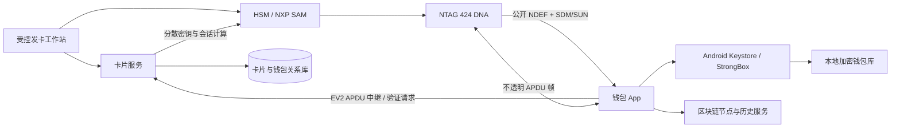

# 安全 NFC 多卡钱包技术方案

> 文档状态：评审修订稿 v1.1  
> 编制日期：2026-09-02  
> 适用项目：Tangem External Wallet、NFC Writer、Secure NFC 组件

## 1. 方案结论

本项目建议采用以下账户规则：

- 一张未绑定的新卡首次激活时，创建一个独立钱包。
- 同一张卡以后在同一设备或恢复后的设备上扫描，始终进入同一个钱包。
- 另一张未绑定的新卡默认创建另一个独立钱包。
- 只有用户主动进入“添加备用卡”流程，才允许多张卡关联同一个钱包。
- 修改跳转目标网址只改变网页重定向，不改变卡片身份、钱包 ID、地址或密钥。

当前使用的 NTAG 424 DNA 负责：

1. 证明卡片是由我方初始化的合法卡；
2. 提供每张卡唯一的安全身份；
3. 在创建钱包、解锁钱包和发起交易时证明一次新鲜的实体卡在场；
4. 通过公开 NDEF 上的 SDM/SUN 和服务端辅助的 EV2 相互认证降低复制、伪造、重放及预采集风险。

NTAG 424 DNA **不负责区块链私钥签名，也不能在卡片上向用户展示或确认交易明细**。钱包私钥由手机生成，使用 Android Keystore/StrongBox 保护的钱包加密密钥进行封装，实际链上签名通常仍由手机 App 完成。若产品必须做到“私钥永不进入手机、交易由卡片内部直接签名”，必须更换为支持 secp256k1、Ed25519 等算法及安全 APDU 签名的安全芯片卡。

## 2. 当前实现审计结论

当前版本适合流程演示，不具备多用户正式发卡条件：

| 项目 | 当前实现 | 风险 |
| --- | --- | --- |
| 卡片数据 | 仅保存固定格式和跳转 URL | 不包含独立钱包身份 |
| 卡片 UID | 用于派生 AES 密钥，验证完成后被丢弃 | 不同卡无法进入不同账户 |
| 扫描结果 | 只有 `Accepted/Rejected` | 钱包层拿不到卡片身份 |
| 钱包状态 | 单一全局 `wallet_created` | 任意一张卡创建后，其他卡都被视为已创建 |
| 钱包公钥 | 使用固定 Mock 公钥和派生数据 | 所有用户显示相同地址 |
| 卡号 | 使用固定 Mock `cardId` | 多卡无法区分 |
| AES 根密钥 | 编译进钱包及写卡 APK | APK 被逆向后可能扩大到全部卡片 |
| 交易签名 | 沿用 Tangem SDK 交互外观，但外部卡没有对应签名能力 | 容易形成“看似贴卡签名、实际不是卡签名”的错误安全认知 |

在完成本方案改造和安全验证前，不得使用当前固定 Mock 钱包接收真实资产。

## 3. 目标与非目标

### 3.1 目标

- 每张主卡默认对应一个唯一钱包。
- 同一钱包可以显式绑定多张备用卡。
- 钱包账户不能由公开 UID 直接推导。
- 卡片跳转网址与钱包身份完全解耦。
- 写卡工具可以批量、安全、可审计地初始化卡片。
- 钱包 APK 中不包含任何生产卡主密钥或可长期复用的每卡密钥。
- 扫描、激活、解锁、交易确认和恢复均有明确状态机。
- 服务端只保存卡片绑定关系和公开钱包信息，不接触助记词及钱包私钥。

### 3.2 非目标

- 不把 NTAG 424 DNA 描述为硬件签名钱包。
- 不在卡片中保存明文助记词或区块链私钥。
- 不通过公开 UID 确定性生成钱包私钥。
- 不允许普通写卡 APK 离线持有全局生产管理密钥。
- 不把本方案描述为能够抵御手机系统或钱包签名代码已被完全控制的攻击；卡片没有可信显示屏，无法独立核对交易明细。

## 4. 总体架构



系统采用两套用途明确的卡片验证方式：

1. **公开贴卡与网页跳转**：读取 File 02 中的标准 NDEF，使用 SDM/SUN 动态字段、MAC 和读计数器由服务端验真。普通系统 NFC 也可以打开入口网址。
2. **钱包安全操作**：激活、绑定、解锁和交易确认使用服务端辅助的 EV2 相互认证。App 只负责在卡片与 Card Service 之间中继不透明 APDU 帧；每卡长期密钥和会话密钥留在 HSM/SAM 或受控服务端安全边界内。

SUN 证明一条带计数器消息由卡片生成，但不能直接对任意服务端随机数签名。涉及资产的操作必须采用 EV2 在线挑战，不得把一次普通 SUN URL 读取等同于交易挑战响应。

### 4.1 组件职责

| 组件 | 职责 |
| --- | --- |
| NFC Writer | 检测卡型、校验 NXP 原创性签名、请求发卡任务、初始化密钥、写入文件和回读校验 |
| Secure NFC | NTAG 424 APDU、SDM/SUN 载荷、EV2 中继状态机、文件编解码；不在客户 APK 内派生生产密钥 |
| Wallet App | 扫卡和 APDU 中继、创建与恢复钱包、卡片绑定、交易构建、手机端签名 |
| Card Service | SUN/EV2 验真、短时验证令牌、激活、绑定、状态管理、重放检测和审计 |
| HSM/SAM | 保存 AES 主密钥，执行每卡密钥分散、EV2 会话及验证计算，不导出长期密钥 |
| Android Keystore | 保护本地钱包包装密钥和设备认证密钥，并记录实际硬件安全级别 |

## 5. 身份与账户模型

### 5.1 标识定义

| 标识 | 生成方式 | 是否公开 | 用途 |
| --- | --- | --- | --- |
| `cardInstanceId` | 发卡时 CSPRNG 生成 128 位随机值 | 公开但不可预测 | NDEF 中的卡片选择器；唯一区分实体卡，禁止重复 |
| `chipUid` | NTAG 芯片 UID | 不作为钱包 ID；不直接写日志 | 每卡密钥分散、原创性签名及芯片核对 |
| `walletId` | 钱包创建时 CSPRNG 生成 256 位随机值 | 可公开 | 稳定的钱包业务主键，不随链或派生路径变化 |
| `walletControlKey` | 从钱包恢复秘密按版本化、域分离 profile 派生 | 只上传公钥 | 对认领、恢复和高风险设备变更提供可验证的控制权证明 |
| `deviceKeyId` | Android Keystore 设备公钥的稳定指纹 | 可公开 | 识别获授权设备及验证设备请求签名 |
| `userId` | 匿名账户或用户登录体系生成 | 内部 | 归属管理；可在第一期省略登录 |

不得使用 `chipUid`、手机号、网址或连续编号直接生成钱包私钥。

### 5.2 关系规则

```text
User 1 --- N Wallet
Wallet 1 --- N CardBinding
Wallet 1 --- N AuthorizedDevice
Card 1 --- 0..1 Active Wallet
```

- 一张卡在同一时间最多绑定一个活动钱包。
- 一个钱包可以有一张主卡和多张备用卡。
- 备用卡绑定必须由已授权设备加主卡确认，或通过恢复流程完成。
- 卡片解绑、挂失、冻结不应删除链上钱包。

### 5.3 卡片状态机

```text
BLANK -> PROVISIONING -> UNCLAIMED -> ACTIVE -> SUSPENDED -> ACTIVE
              |               |          |
              v               v          v
        QUARANTINED         REVOKED    REVOKED
```

- `BLANK`：出厂默认状态；仅受控写卡工具可处理。
- `PROVISIONING`：一次性发卡任务执行中，不允许客户认领。
- `QUARANTINED`：发卡中断、部分密钥已更新或回读校验失败；只能由受控工作站恢复或作废。
- `UNCLAIMED`：已完成原创性验证、密钥更新、文件写入和回读校验，但尚未绑定客户钱包。
- `ACTIVE`：已绑定钱包，可以用于解锁和交易确认。
- `SUSPENDED`：临时冻结，可恢复。
- `REVOKED`：永久作废，禁止重新绑定。

## 6. 卡片载荷格式

将现有 URL-only 的 `NBSC v1` 升级为相互独立的公开入口和私有元数据。

### 6.1 File 02：标准 NDEF 与 SDM/SUN

File 02 必须保存合法的 NFC Forum NDEF URI Record，例如：

```text
https://card.example.com/t/{cardInstanceId}?v=2&kv={keyVersion}&picc={SDM_PICC_DATA}&mac={SDM_MAC}
```

- `cardInstanceId` 和 `keyVersion` 是公开但不可预测的选择器，并纳入 SDM MAC 覆盖范围。
- `picc` 由卡片动态镜像 UID、读计数器等数据，优先使用加密 PICCData。
- `mac` 由卡片按 SDM 配置生成，服务端通过 HSM/SAM 验证。
- 固定入口域名只负责验真和重定向，实际 `targetUrl` 保存在服务端卡片配置中；普通改网址不需要重写卡片。
- 若业务必须更换卡内入口域名，必须走受控写任务并重新回读验证，不得由客户 App 写卡。

### 6.2 File 03：受保护的 `NBSC v2` 元数据

File 03 使用 Full secure messaging，仅供发卡、审计和受控维护读取：

```text
magic             4 bytes   "NBSC"
payloadVersion     1 byte    0x02
cardInstanceId    16 bytes   随机卡片业务 ID
keyVersion         1 byte    AES 主密钥版本
flags              1 byte    卡型/功能标志
issuedAt            8 bytes   Unix 时间
batchId            16 bytes   发卡批次随机 ID
reserved            8 bytes   必须写 0，供以后兼容扩展
```

要求：

- 所有多字节整数使用大端序；`issuedAt` 为 Unix 秒。
- `cardInstanceId` 初始化后不可改变；File 02 和 File 03 的值必须一致。
- `keyVersion` 既存在于公开 NDEF，也存在于 File 03 和服务端记录中，三者不一致时卡片进入隔离状态。
- File 03 已由 Full secure messaging 提供机密性和完整性，不再增加定义不清的自定义 `payloadMac`。
- 服务端必须同时核对 `cardInstanceId`、加密保存的芯片身份或 HSM key handle、SUN/EV2 认证数据及卡片状态。
- 不在卡片内保存助记词、私钥、登录 Token 或用户个人资料。

## 7. 密钥体系

### 7.1 卡片 AES 密钥

保留按卡分散的思想，但将主密钥和每卡长期密钥全部移出客户 APK。密钥分散采用经审计的 NXP AN10922 AES-CMAC 方案或等价的标准化 HSM profile，不继续扩展当前自定义 KDF。其上下文必须采用固定编码并包含用途域分离：

```text
K_admin(card) = KDF(AdminMaster[keyVersion], chipUid, cardInstanceId, 0)
K_sdm(card)   = KDF(SdmMaster[keyVersion],   chipUid, cardInstanceId, 1)
K_auth(card)  = KDF(AuthMaster[keyVersion],  chipUid, cardInstanceId, 2)
K_write(card) = KDF(WriteMaster[keyVersion], chipUid, cardInstanceId, 3)
K_resv(card)  = KDF(ReserveMaster[keyVersion], chipUid, cardInstanceId, 4)
```

- `AdminMaster`、`SdmMaster`、`AuthMaster`、`WriteMaster`、`ReserveMaster` 只能存在于 HSM、SAM 或受控服务端安全边界。
- Key 0 用于管理、改密钥和文件配置；Key 1 仅用于 SDM/SUN；Key 2 用于钱包 EV2 相互认证并授权 File 03 受控读取；Key 3 用于受控写入；Key 4 预留给轮换/恢复。SUN 和钱包 EV2 不复用同一密钥。最终访问权限字节必须形成单独的、经实体卡验证的卡片 profile。
- 客户版 Wallet APK 不应持有任何全局主密钥。
- 对外分发的 NFC Writer APK 不应具备生产卡管理能力。
- 发卡工作站通过短时、单任务凭证调用 HSM/SAM；HSM 可以返回发卡所需的受保护命令或短时会话结果，但不得返回主密钥。
- Card Service 通过公开 `cardInstanceId` 查找卡记录和 HSM key handle，再执行 SUN 或 EV2 验证，不要求 App 自行派生密钥。
- 数据库除 `chip_uid_hmac` 外，还必须保存 HSM key handle 或由独立 KEK 加密的 UID，供轮换和按需分散使用；普通加盐哈希不能承担该用途。
- `keyVersion` 只用于选择密钥代际。轮换必须实际更新实体卡密钥并完成回读校验，不能只修改 NDEF 或数据库字段。
- 卡片 profile 必须明确是否启用 Random ID。无论是否启用，客户 App 都不得把 Android `Tag.id` 当作稳定身份或钱包键；启用前必须在受控发卡阶段登记真实 UID，运行时以服务端验证后的 PICCData 为准。

### 7.2 钱包密钥

推荐第一阶段采用非托管手机钱包：

1. 手机使用系统 CSPRNG 生成助记词/种子；
2. 生成各链钱包公钥和地址，并按照固定、版本化、域分离且经过兼容性审计的 profile 派生 `walletControlKey`；
3. 种子经独立钱包数据加密密钥（DEK）加密后存入本地，使用带认证加密并绑定钱包版本等 AAD；
4. DEK 由 Android Keystore 中的包装密钥保护；优先 StrongBox，其次 TEE，并显式记录软件回退或不支持状态；
5. 钱包数据库和密文种子必须排除在 Android 自动备份之外，恢复必须走单独设计的恢复包；
6. 使用私钥前要求逐次系统认证，并按产品策略完成已绑定卡的 EV2 在线验证；
7. 对 secp256k1、Ed25519 等无法由设备硬件直接执行的链，种子或私钥会在 App 受控内存中短时解密并由链签名器使用，完成后尽力清零；不得宣称这些交易由 StrongBox 直接签名；
8. 服务端只保存公开地址、钱包 ID、控制权证明和卡片绑定，不保存种子。

卡片认证不能代替用户恢复能力。必须提供以下至少一种恢复方式：

- 用户自行备份助记词；
- 客户端分片加密备份；
- 明确告知风险的企业托管恢复方案。

## 8. 核心业务流程

### 8.1 发卡初始化

1. 服务端创建一次性发卡任务，并将卡片数据库状态置为 `PROVISIONING`。
2. 写卡工具读取芯片类型、UID 和 NXP 原创性签名，确认是支持的 NTAG 424 DNA；原创性签名只作为供应链检查的一层，不能代替后续 AES 验真。
3. 服务端生成 `cardInstanceId`、`keyVersion`、`batchId` 和任务随机数，保存 HSM key handle 或加密 UID。
4. HSM/SAM 根据确定的卡片 profile 计算每卡密钥或生成受保护命令。
5. 工具认证出厂卡，按可恢复顺序更新五个应用密钥及其版本。
6. File 02 写入合法 NDEF URI Record 并配置 SDM；File 03 写入 `NBSC v2` 元数据和 Full secure messaging 访问权限。
7. 分别使用新的 SDM、读、写和管理角色进行正向/反向测试，并回读核对 File 02、File 03、密钥版本和文件设置。
8. 所有检查成功后，服务端原子地将卡片置为 `UNCLAIMED`；任一步骤失败则置为 `QUARANTINED`，禁止客户认领。
9. 工具销毁短时会话和敏感缓冲区，不在本地保存生产密钥或可复用发卡凭证。

### 8.2 新卡首次激活

1. App 读取公开 NDEF，取得 `cardInstanceId`、`keyVersion` 和 SUN 证据，服务端先校验 SDM MAC、计数器和卡片状态。
2. App 保持卡片在场，向卡片发送固定 profile 允许的 EV2 首帧，并把卡片首个响应随用途为 `CLAIM` 的会话创建请求上传 Card Service。
3. Card Service/HSM 返回下一步受保护 APDU，App 与卡片完成剩余 EV2 相互认证并上传最终响应；服务端成功后签发单次 `cardVerificationToken`。标准流程应控制在两次服务端网络往返内。
4. App 显示“创建新钱包”或“绑定为备用卡”，不得自动替用户选择。
5. 用户选择创建新钱包后，手机生成独立钱包种子及随机 `walletId`，生成设备认证密钥并取得可用的硬件证明。
6. App 上传公开地址摘要、设备公钥及其证明，并使用钱包控制密钥和设备密钥对认领上下文签名，证明请求不是单纯复制公开地址。
7. 服务端在一个事务中消费验证令牌并绑定 `cardInstanceId -> walletId`；令牌、卡片和钱包任一不一致都必须失败。
8. App 将钱包加密保存并进入后续流程。

### 8.3 同一卡片再次扫描

1. 重新执行 SUN 初筛和用途为 `UNLOCK` 的 EV2 在线认证，不能只依赖本地缓存。
2. 服务端返回现有 `walletId` 和卡片状态。
3. App 在本地找到对应钱包后解锁并进入。
4. 本地不存在钱包时进入恢复流程，不得生成第二个同名钱包。

### 8.4 扫描另一张新卡

- 未绑定卡默认进入“创建独立钱包”页面。
- 若用户选择“添加备用卡”，必须再次验证当前主卡或恢复凭证。
- 禁止仅因当前 App 已有钱包就自动把新卡并入旧钱包。

### 8.5 交易确认与签名

1. App 构建交易并展示币种、金额、网络、地址和费用，使用每条链规定的规范编码计算 `txHash`。
2. App 使用设备密钥请求交易挑战；服务端挑战必须绑定 `walletId`、`deviceKeyId`、链、`txHash`、随机数、用途和有效期。
3. 用户贴已绑定的活动卡；App 中继 EV2 相互认证，HSM 使用与该挑战关联的新鲜随机数完成卡片在场验证。
4. 服务端验证挑战、卡片、钱包、设备、用途和有效期的一致性，原子消费挑战并返回服务端签名的单次 `transactionApprovalToken`。
5. App 在签名前校验令牌签名以及其中的 `txHash`，然后请求逐次生物识别或设备密码解锁 Android Keystore。
6. App 解开钱包 DEK，短时解密种子/私钥，由真实链签名器完成签名并尽力清理敏感内存。
7. App 广播交易并保存公开交易记录；挑战或系统认证取消时不得签名、广播或复用批准令牌。

界面必须明确显示“已验证卡片在场”和“手机 App 完成链上签名”。除非该链的私钥确实由硬件 Keystore 直接持有并签名，否则不得显示“手机安全区完成签名”；任何情况下都不能宣称 NTAG 卡确认了交易明细或完成了区块链签名。

### 8.6 换机与恢复

- 同一卡片在新手机上通过 SUN 初筛和 EV2 在线认证确认原 `walletId`；该结果只恢复钱包业务身份，不恢复资产私钥。
- 用户必须提供助记词、加密备份或企业恢复凭证恢复私钥。
- 只有卡片、没有恢复材料时，不能假装已恢复钱包私钥。
- 恢复出的公开根指纹必须与原钱包记录一致，否则停止恢复并提示用户。
- 恢复完成后，通过恢复授权流程登记新 `deviceKeyId`，必要时撤销旧设备；不能仅凭知道 `walletId` 注册设备。

## 9. 服务端接口草案

所有接口使用 TLS。常规客户请求必须由已登记的设备密钥签名；首次激活的引导请求使用待登记设备密钥签名，并同时提交服务端 challenge 对应的有效 attestation。涉及状态变更的请求还必须具备幂等键、短时授权令牌、签名时间窗和审计 ID。服务端返回的验证/批准令牌必须签名、单次使用、限定用途和资源，并只保存其哈希。

| 方法 | 路径 | 用途 |
| --- | --- | --- |
| `POST` | `/v1/provisioning/jobs` | 创建一次性发卡任务 |
| `POST` | `/v1/provisioning/jobs/{id}/complete` | 提交回读校验结果 |
| `POST` | `/v1/card-verifications` | 提交 SUN 初筛证据和 EV2 首个卡片响应，创建限定用途的验证会话 |
| `POST` | `/v1/card-verifications/{id}/frames` | 中继下一步 EV2 APDU 帧；限制帧数、顺序和超时 |
| `POST` | `/v1/card-verifications/{id}/complete` | 完成验证并取得单次验证令牌 |
| `POST` | `/v1/cards/{cardId}/claim` | 首次绑定钱包 |
| `GET` | `/v1/cards/{cardId}/binding` | 使用有效验证令牌或已授权设备查询绑定与状态 |
| `POST` | `/v1/wallets/{walletId}/backup-cards` | 绑定备用卡 |
| `POST` | `/v1/cards/{cardId}/suspend` | 临时冻结 |
| `POST` | `/v1/cards/{cardId}/revoke` | 永久作废 |
| `POST` | `/v1/wallets/{walletId}/devices` | 使用恢复或既有设备授权登记新设备 |
| `POST` | `/v1/wallets/{walletId}/devices/{deviceId}/revoke` | 撤销设备 |
| `POST` | `/v1/transactions/challenges` | 创建交易确认挑战 |
| `POST` | `/v1/transactions/challenges/{id}/confirm` | 提交卡片确认结果 |

`POST /v1/card-verifications` 请求示例：

```json
{
  "cardInstanceId": "base64url-16-byte-id",
  "keyVersion": 1,
  "purpose": "TRANSACTION",
  "resourceId": "transaction-challenge-id",
  "ndefMessage": "base64url-original-ndef-bytes",
  "firstCardFrame": "base64url-ev2-first-card-response",
  "deviceKeyId": "device-public-key-id",
  "requestNonce": "base64url-random-nonce",
  "deviceSignature": "base64url-signature"
}
```

服务端必须自行解析原始 NDEF 并验证 MAC，不能信任客户端上报的已解析计数器或 UID。EV2 `/frames` 接口只接受协议状态机期望的下一帧，禁止成为任意 HSM 加解密 oracle。响应只返回受保护 APDU、业务状态、公开信息或短时令牌，不返回 AES 长期密钥、会话密钥或钱包私钥。

## 10. 数据库模型草案

### `cards`

- `card_instance_id`：主键；随机 128 位值
- `chip_uid_hmac`：使用独立服务端密钥计算，用于等值检测；普通盐化哈希不合格
- `chip_uid_ciphertext` 或 `hsm_key_handle`：用于 HSM 按卡派生、轮换和芯片核对；应用数据库不得保存明文 UID
- `key_version`
- `batch_id`
- `target_url`：只允许 HTTPS，并经过域名/协议策略和开放重定向检查
- `status`
- `issued_at`
- `claimed_at`
- `last_sdm_counter`：24 位无符号数，更新时必须使用行锁或条件更新防止并发回退
- `counter_exhaustion_state`
- `created_at` / `updated_at`

### `wallets`

- `wallet_id`：主键
- `user_id`：可空，支持匿名卡钱包
- `root_public_key_hash`：恢复一致性检查使用
- `control_public_key`：用于证明认领和恢复请求确由钱包控制方发起
- `recovery_mode`
- `created_at` / `updated_at`

### `card_bindings`

- `card_instance_id`
- `wallet_id`
- `role`：`PRIMARY` / `BACKUP`
- `status`
- `bound_at`
- `revoked_at`
- 唯一约束：一张活动卡只能绑定一个活动钱包

### `authorized_devices`

- `device_key_id`
- `wallet_id`
- `public_key`
- `attestation_level`
- `attestation_chain_digest`
- `verified_boot_state`
- `app_identity_digest`
- `status`
- `last_seen_at`

### `card_verification_sessions`

- `verification_id`
- `purpose`：`CLAIM` / `BIND_BACKUP` / `UNLOCK` / `TRANSACTION` / `RECOVERY`
- `resource_id`：钱包、交易挑战或恢复会话 ID
- `card_instance_id` / `device_key_id`
- `state` / `frame_index` / `expires_at`
- `token_hash` / `consumed_at`

验证会话必须限制最长时长、最大 APDU 帧数和合法状态迁移；超时、断连、乱序或重复帧立即销毁 HSM 会话。

### `security_events`

- `event_id`
- `event_type`
- `card_instance_id`
- `wallet_id`
- `device_key_id`
- `result`
- `risk_code`
- `created_at`

日志不得记录助记词、私钥、AES 密钥、完整动态认证数据或登录凭证。

## 11. Android 客户端改造

### 11.1 Secure NFC

- `SecureCardPayload` 拆分为标准 NDEF/SDM v2 解析器和 File 03 `SecureCardMetadataV2`，并保留明确的 v1 识别能力。
- 增加 `SecureCardIdentity`：`cardInstanceId`、`keyVersion`、原始 NDEF/SUN 证据；客户 App 模型不暴露或依赖明文 `chipUid`。
- 增加严格的 EV2 APDU 中继状态机，只允许 Card Service 指定的认证命令序列，禁止把客户端实现变成通用写卡器。
- `SecureCardKeys` 的生产分散逻辑移到 HSM/SAM 侧；客户端模块只保留开发测试 profile 和协议数据类型。
- 所有字节数组比较使用常量时间实现。
- 清理敏感临时缓冲区并限制日志。

### 11.2 Wallet App

- `ExternalNdefTagReader.read()` 从布尔结果改为返回 `Accepted(SecureCardIdentity)`。
- `ExternalNdefScanController.Result` 携带卡片身份和验证会话。
- 删除 `ExternalNdefWalletMockContent` 的固定卡号、公钥、地址和全局创建标志。
- 新增 `CardBindingRepository`、`CardVerificationRepository`、`AuthorizedDeviceRepository` 和 `WalletVaultRepository`。
- `walletId` 使用独立随机 ID；同时保存真实钱包根公钥指纹用于恢复校验，禁止使用卡片 URL 或公开 UID 代替钱包身份。
- 交易签名改用真实手机钱包签名器；扫描卡只作为新鲜在场授权步骤，不描述为卡片确认交易明细。
- 钱包 DEK 使用 Keystore 包装并按次认证；本地钱包密文排除在 Android 自动备份之外。
- 设备注册时上传服务器 challenge 对应的 attestation 证书链，并由服务端验证链、应用身份、启动状态和官方撤销列表。
- 本地状态按 `walletId` 和 `cardInstanceId` 分区。

### 11.3 NFC Writer

- 拆分 `development` 和 `production` 模式。
- 开发模式只允许测试密钥和测试卡，并明显显示水印。
- 生产模式必须登录发卡工作站并取得一次性任务。
- 移除 APK 内的全部生产 AES 主密钥和可长期复用的每卡密钥。
- 写卡成功必须同时通过卡片回读与服务端登记校验。
- 写卡中断或部分成功时必须登记 `QUARANTINED`，提供受控恢复或永久作废操作。
- 普通改网址改为更新 Card Service 的重定向目标，不重新生成 `cardInstanceId`、不重写实体卡、不改变钱包绑定。

## 12. 安全控制

### 12.1 必须实施

- 主密钥由 HSM/SAM 托管并设置用途隔离。
- 所有卡片密钥按卡、按用途分散，支持 `keyVersion` 和实体卡密钥轮换。
- 交易、认领、绑定、解锁和恢复挑战必须带随机数、有效期、用途、卡片、设备和目标资源。
- SUN 只用于公开入口和初筛；涉及钱包资产的操作必须完成新的 EV2 在线会话。
- 服务端记录并原子拒绝重复或倒退的 24 位 SDM 计数器、重复挑战、重复令牌和过期会话，并监控计数器接近耗尽。
- EV2 中继接口执行固定状态机、速率限制、帧数限制和 HSM oracle 防护。
- 卡片认领接口使用数据库唯一约束和事务，防止并发双绑。
- 卡片认领同时要求单次卡验证令牌、设备请求签名和钱包控制权证明。
- App 使用 Android Keystore，优先 StrongBox/TEE，记录实际安全级别，并为不支持或密钥失效定义降级/恢复策略。
- 服务端验证设备 attestation 证书链、challenge、应用身份、启动状态和官方撤销列表。
- 客户 App 不假定 NFC `Tag.id` 恒为 7 字节或长期不变；卡片业务身份只来自经过 SUN/EV2 验证的 `cardInstanceId`。
- 创建钱包、导出助记词、绑定备用卡、发送交易均要求明确用户确认。
- APK、日志、崩溃报告、备份文件中不得出现生产密钥。
- 上线前进行移动端逆向检查、接口渗透测试和密码学专项审计。

### 12.2 不能依赖的控制

- 仅靠 APK 混淆隐藏密钥；
- 仅靠 UID 防克隆；
- 仅靠卡内固定 URL 判断合法卡；
- 仅靠一次 SUN URL 读取证明服务端挑战的新鲜性；
- 仅靠 NXP 原创性签名防止单卡模拟或密钥泄露；
- 仅靠本地 `SharedPreferences` 判断卡片归属；
- 仅靠“扫描成功”提示代表交易已由卡片签名；
- 仅靠 Keystore 包装种子就宣称所有链上签名都在安全硬件内完成；
- 仅靠 HTTPS 而不做挑战防重放和服务端状态检查。

## 13. 旧卡迁移

当前 `NBSC v1` 卡只包含 URL，无法形成可靠的独立钱包身份。建议：

1. 将现有卡全部标记为测试卡；
2. 新版本 App 禁止 v1 卡承载真实资产；
3. 使用受控写卡流程将可重写卡升级为 v2；
4. 升级时校验原创性签名，生成新的 `cardInstanceId`，写入标准 NDEF/SDM 和 File 03，更新全部卡片密钥并回读校验；
5. 若旧测试钱包存在余额，先人工转出，再迁移卡片；
6. 无法安全升级的卡直接作废，不进行静默兼容。

旧卡升级会改变安全配置，必须提供明确确认和失败恢复步骤。升级中断的卡进入 `QUARANTINED`，不得继续被 v1 或 v2 客户流程接受。

## 14. 分阶段实施

### 阶段 0：冻结风险

- 禁止当前固定 Mock 地址用于真实资产。
- 将现有 APK 标记为测试构建。
- 统计已写卡数量、UID 批次和是否存在余额。

### 阶段 1：本地多卡原型

- 实现标准 NDEF/SDM v2、File 03 `NBSC v2`、`SecureCardIdentity` 和按卡状态存储。
- 每张卡创建不同的本地测试钱包和地址。
- 完成同卡复扫、新卡创建和服务端网址独立修改测试。
- 仅允许测试网，不对客户发布。

### 阶段 2：卡片服务与安全发卡

- 建立 Card Service、数据库和审计日志。
- 接入 HSM/SAM 或受控密钥服务。
- 实现原创性校验、安全发卡、SUN 验证、EV2 APDU 中继、认领、备用卡、冻结和作废。
- 完成实体卡网络延迟、断连、重复帧、计数器并发和隔离恢复测试。
- 取消任何生产卡长期密钥进入 APK。

### 阶段 3：真实钱包与交易确认

- 接入 Android Keystore 钱包金库、逐次系统认证和自动备份排除策略。
- 使用真实每钱包公钥和地址替代全部 Mock 数据。
- 接入与规范化 `txHash` 绑定的 EV2 卡片在场验证、服务端批准令牌和真实手机端签名。
- 完成恢复、换机和设备撤销流程。

### 阶段 4：试点与上线

- 进行密码学审计、移动端逆向、接口渗透和灾难恢复演练。
- 小批量测试卡试点，设置限额和监控。
- 验收通过后再扩大生产批次。

## 15. 验收用例

| 编号 | 场景 | 预期结果 |
| --- | --- | --- |
| A01 | 卡 A 首次激活 | 创建钱包 A，生成独立地址 |
| A02 | 卡 A 再次扫描 | 返回钱包 A，不重复创建 |
| A03 | 卡 B 首次激活 | 创建钱包 B，地址与 A 不同 |
| A04 | 卡 B 尝试自动进入 A | 必须失败，除非显式绑定备用卡 |
| A05 | 修改卡 A 跳转网址 | 钱包 A、地址和绑定不变 |
| A06 | 清除 App 数据后扫描 A | 识别原 walletId，进入恢复流程 |
| A07 | 复制旧认证报文 | 服务端拒绝重放 |
| A08 | 被冻结卡扫描 | 拒绝解锁和交易确认 |
| A09 | 普通 NFC 工具读取 | 只能取得公开 NDEF 并打开入口网址，无法读取 File 03 |
| A10 | 逆向钱包 APK | 找不到任何生产 AES 主密钥或可长期复用的每卡密钥 |
| A11 | 交易时扫描未绑定卡 | 拒绝确认 |
| A12 | 扫描绑定卡后取消系统认证 | 不签名、不广播 |
| A13 | 新手机只有卡、没有恢复材料 | 明确提示无法恢复私钥 |
| A14 | 主卡绑定备用卡 | 两张卡进入同一 walletId，其他新卡不受影响 |
| A15 | 修改 `cardInstanceId`、`keyVersion` 或 SDM 字段 | 服务端 MAC 校验失败并拒绝 |
| A16 | 预先收集 SUN URL 后用于交易挑战 | 因未完成该挑战对应的 EV2 在线会话而拒绝 |
| A17 | EV2 中继乱序、超时或超帧 | 销毁会话，不签发验证令牌 |
| A18 | 发卡中途断电 | 卡片进入 `QUARANTINED`，不能认领 |
| A19 | 并发提交相同 SDM 计数器或验证令牌 | 最多一次成功 |
| A20 | 交易内容在贴卡后发生变化 | `txHash` 与批准令牌不一致，拒绝签名 |
| A21 | 恢复出的根公钥指纹不一致 | 拒绝加入原 walletId |
| A22 | Keystore/StrongBox 不支持目标算法 | 使用文档化的钱包解密与 App 签名路径，UI 不声称硬件签名 |
| A23 | 弱网或中途移开卡片 | EV2 会话超时失败且不可续用，提示重新完整贴卡 |
| A24 | 启用 Random ID 后重复扫描同一卡 | Android `Tag.id` 可变化，但服务端仍安全解析为同一 `cardInstanceId` |

## 16. 上线门槛

以下条件全部满足前，不进入真实资产生产环境：

- 不同新卡产生不同 walletId、主公钥和地址；
- 同一卡在重装和换机后不会被误创建为新钱包；
- 固定 Mock 卡号、公钥、地址和签名响应全部移除；
- 生产 AES 主密钥不进入任何对外 APK；
- 公开 NDEF/SDM、File 03、五个密钥角色及 EV2 中继 profile 已在实体卡上通过测试；
- 交易卡验证绑定规范化 `txHash`，且签名来源可被技术和 UI 准确说明；
- 服务端无法把 EV2 帧接口用作任意 HSM 加解密 oracle；
- EV2 在线认证在支持机型、目标地区网络和前后台切换场景达到经产品确认的贴卡时长与成功率 SLA；
- 卡片服务具备高可用、限流、审计、备份和恢复能力；
- 卡片丢失、手机丢失、服务不可用、计数器耗尽、发卡中断和密钥轮换均有演练记录；
- 独立安全审计的高危问题全部关闭。

## 17. 需要产品确认的决策

1. 是否正式确认产品定位为“手机钱包 + NFC 在场验证卡”；如果选择真正硬件签名钱包，本方案停止并更换卡片芯片？
2. 用户是否需要登录账号，还是保持匿名卡钱包？
3. 恢复方式采用助记词、加密云备份还是企业托管？
4. 是否允许一套钱包绑定多张备用卡，最多几张？
5. 服务端不可用时，是否允许只查看余额，是否禁止签名？
6. 现有已写卡是否全部可召回并重新初始化？
7. 第一阶段只测试网试点，还是计划直接支持主网？
8. 是否接受激活、绑定、解锁和交易确认依赖 Card Service 在线可用；离线时是否只允许查看公开余额？
9. Android 最低安全等级是什么：允许软件 Keystore、至少 TEE，还是必须 StrongBox？不达标设备是只读还是完全拒绝？
10. EV2 在线认证可接受的贴卡时长、成功率和目标地区网络 SLA 是多少？
11. 生产卡是否启用 NTAG Random ID；若启用，隐私收益、兼容机型和售后诊断如何取舍？

## 18. 官方技术依据

- NXP NTAG 424 DNA 产品说明：AES-128、安全通信、SUN 动态认证及 Type 4 Tag 能力。  
  https://www.nxp.com/products/rfid-nfc/nfc-hf/ntag-for-tags-and-labels/ntag-424-dna-424-dna-tagtamper-advanced-security-and-privacy-for-trusted-iot-applications:NTAG424DNA
- NXP NTAG 424 DNA 数据手册。  
  https://www.nxp.com/docs/en/data-sheet/NT4H2421Gx.pdf
- NXP AN12196：NTAG 424 DNA 功能、密钥分散和应用建议。  
  https://www.nxp.com/docs/en/application-note/AN12196.pdf
- NXP AN10922：使用 AES-CMAC 进行对称密钥分散。  
  https://www.nxp.com/docs/en/application-note/AN10922.pdf
- Android Keystore：密钥不可导出、TEE/StrongBox 及用途授权。  
  https://developer.android.com/privacy-and-security/keystore
- Android Key Attestation：验证密钥是否由硬件安全区保护。  
  https://developer.android.com/privacy-and-security/security-key-attestation
